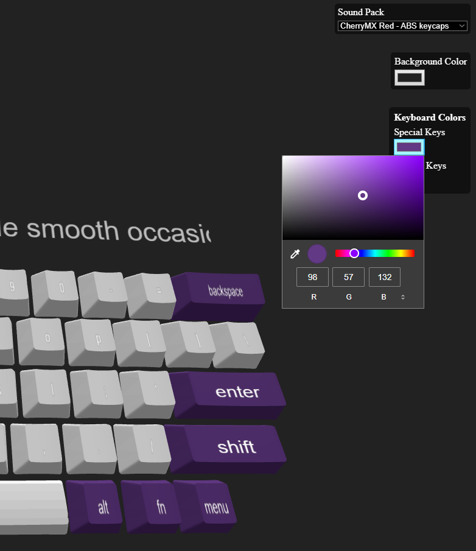
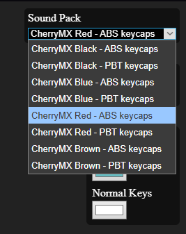
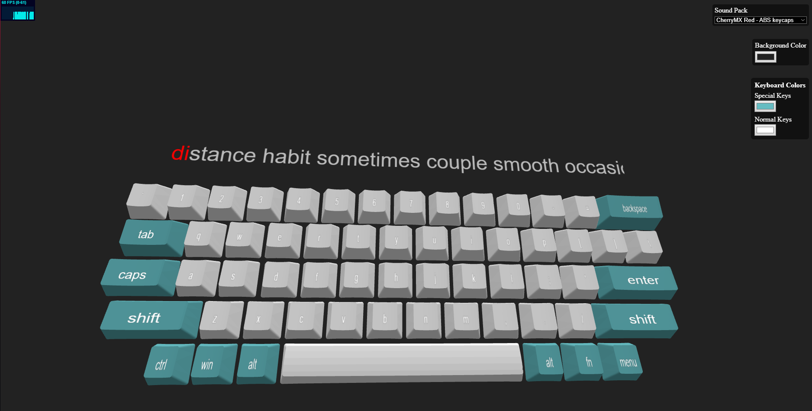

# Clicks

A 3D interactive keyboard with customizable colors, keyboard sounds. Includes typing demo experience.

---

## Features

- Fully 3D-rendered keycaps
- Customizable key colors
- Keyboard sound effects on key press
- Interactive key animations
- Settings panel to adjust colors and sounds
- Typing functionality like Monkeytype for practice/demo

---

## Demo

Try the live demo here: [Demo Link](https://clicks-type.vercel.app)

---

## Screenshots

<div style="display: flex; gap: 10px;">
  
  
</div>

  

---

## Installation

```bash
git clone https://github.com/A56-A5/clicks.git
cd clicks
